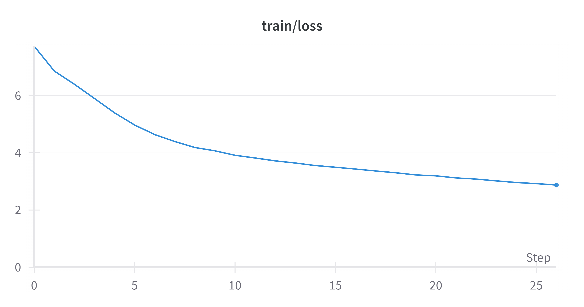

# MY_MIN_GPT

## Introduction

This repository contains the implementation of `my_min_gpt`, inspired by the YouTube video: ["Let's build GPT: from scratch, in code, spelled out"](https://www.youtube.com/watch?v=kCc8FmEb1nY).

Some of the code structure is derived from the video. What's different is that my input data only consists of 5,000 movie reviews, each labeled with a sentiment (positive or negative).

### Objective

The goal is to enable my GPT model to complete a movie review given prompts like "好看" (good) or "难看" (bad).

### Branches

Currently, there are two branches in the repository. Both branches use the same model but differ in how the data is handled during traning.

- The `master` branch combines all reviews together, treating them as one large text (like a book).
- The `hugging_face` branch processes each review individually, with a different tokenization approach. This branch is still under construction.

## Results So Far

Using my favorite (I have trained several models) custom small model with the following configuration:
- 9M parameters
- 12 blocks
- 12 heads
- 252 embedding dimensions
- 64 block size

which loss graphs look like:




I have achieved the following results:

Given the prompt "好看" (good) and "难看" (bad), the model outputs 10 reviews:


The reproduction of negative reviews seems less accurate compared to positive ones. This might be due to an imbalance in the training data, and I am actively working on improving it.

## Building GPT

To produce my own GPT model, the following files are essential:

- `gpt_model.py`: Defines the architecture of the GPT model.
- `train.py`: Handles the training process.

Additionally, `data/prepare.py` is used to preprocess the training data (CSV file), and it's straightforward to understand.

To train the model yourself, follow these steps:

```bash
cd data
python prepare.py
cd ..
python train.py
```

Ensure that each file runs correctly, and configure the hyperparameters before starting the training.

## Inference

To generate text with the trained model, use `inference.py`. Set the model path in the file, then run the file with a command like this:

```bash
python inference.py \
    --start="好看" \
    --num_samples=5 --max_new_tokens=100
```

## To-Do

- [ ] Improve the performance of negative sentiment generation.
- [ ] Finalize the `hugging_face` branch.

## References

YouTube Videos:
- [Let's build GPT: from scratch, in code, spelled out](https://www.youtube.com/watch?v=kCc8FmEb1nY)
- [Let's reproduce GPT-2 (124M)](https://www.youtube.com/watch?v=l8pRSuU81PU&t=4290s)

Papers:
- *Language Models Are Unsupervised Multitask Learners* (GPT-2 paper)
- *Improving Language Understanding by Generative Pre-Training* (GPT-1 paper)
- *Attention Is All You Need* (Transformer paper)

GitHub Repos:
- [nanoGPT](https://github.com/karpathy/nanoGPT)
- [minGPT](https://github.com/karpathy/minGPT)
- [ng-video-lecture](https://github.com/karpathy/ng-video-lecture)